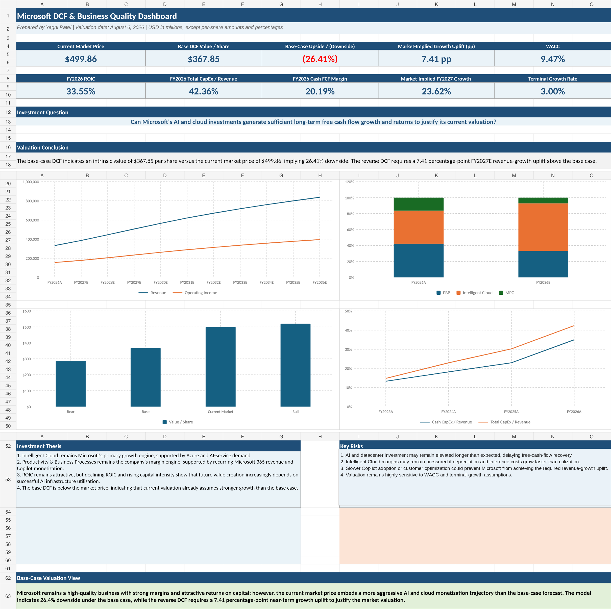

# Microsoft DCF & Business Quality Analysis



A segment-driven valuation and business-quality analysis of Microsoft, built as a portfolio project to answer one central investment question:

> **Can Microsoft's AI and cloud investments generate sufficient long-term free cash flow growth and returns to justify its market valuation?**

**Valuation date:** August 6, 2026  
**Historical period:** FY2021A–FY2026A  
**Forecast period:** FY2027E–FY2036E  
**Primary valuation cash flow:** Lease-adjusted unlevered free cash flow

## Headline findings

| Metric | Result |
|---|---:|
| Current market price | **$499.86** |
| Base DCF value per share | **$367.85** |
| Base-case upside / (downside) | **(26.41%)** |
| WACC | **9.47%** |
| Terminal growth rate | **3.00%** |
| FY2026 ROIC | **33.55%** |
| FY2026 Total CapEx / Revenue | **42.36%** |
| FY2026 Cash FCF margin | **20.19%** |
| Reverse-DCF growth uplift | **7.41 pp** |
| Market-implied FY2027 revenue growth | **23.62%** |

The base case values Microsoft below the market price. Holding the operating-margin, tax, reinvestment, WACC, and terminal-growth paths constant, the reverse DCF indicates that the market price requires approximately **7.41 percentage points** of additional FY2027 consolidated revenue growth above the base case, with the uplift fading to zero by FY2036.

## What differentiates the model

- **Segment-driven forecast:** Productivity & Business Processes, Intelligent Cloud, and More Personal Computing are modeled separately.
- **Reporting-basis control:** FY2023A–FY2026A segment history uses Microsoft's FY2025 recast reporting structure; legacy FY2021A–FY2022A data is separated.
- **Business-quality analysis:** Margin durability, cash conversion, reinvestment intensity, ROIC, and incremental ROIC.
- **Lease-adjusted economics:** Total CapEx includes finance-lease additions, preventing the DCF from understating AI/datacenter reinvestment.
- **Reverse DCF:** Solves for the growth trajectory embedded in the market price.
- **Auditability:** Centralized assumptions, source registry, formula-driven forecasts, and validation checks.
- **Decision-ready presentation:** Executive dashboard, valuation scenarios, and WACC/terminal-growth sensitivity.

## Workbook architecture

| Sheet | Purpose |
|---|---|
| `00_Assumptions` | Centralized operating, reinvestment, WACC, and terminal assumptions |
| `01_Model_Guide_Sources` | Model guide, source registry, audit trail, and presentation notes |
| `02_Historical_Financials` | Consolidated history, cash flow, capital allocation, segments, and checks |
| `03_Business_Quality` | Profitability, cash conversion, reinvestment, ROIC, and incremental ROIC |
| `04_Invested_Capital` | Financing-based invested-capital schedule, including finance leases |
| `05_Segment_Drivers` | Segment revenue and operating-margin forecasts |
| `06_Consolidated_Forecast` | NOPAT, D&A, working capital, Cash-Based UFCF, and Lease-Adjusted UFCF |
| `07_DCF` | Mid-year DCF, terminal value, equity bridge, and diagnostics |
| `08_Reverse_DCF` | Market-implied enterprise value and solved growth uplift |
| `09_Sensitivity_Analysis` | WACC/terminal-growth matrix and valuation scenarios |
| `10_Dashboard` | Executive summary of valuation, growth, returns, and risks |

## Core methodology

### Unlevered free cash flow

```text
NOPAT
+ Depreciation, amortization & other noncash charges
- Total CapEx (cash CapEx + finance-lease additions)
- Change in operating net working capital
= Lease-adjusted UFCF
```

The workbook also presents Cash-Based UFCF as a liquidity measure, but the DCF discounts **Lease-Adjusted UFCF** because Microsoft uses finance leases to fund material datacenter infrastructure.

### ROIC

```text
NOPAT / Average invested capital
```

Invested capital includes stockholders' equity, interest-bearing debt, and finance-lease liabilities, less non-operating cash and investments.

### WACC

```text
Equity weight × Cost of equity
+ Debt weight × After-tax cost of debt
```

The risk-free rate is dated to the valuation date. Equity risk premium, beta, pre-tax cost of debt, and terminal growth are transparent analyst assumptions.

## Selected model outputs

- Enterprise value: **$2,735,267 million**
- Equity value: **$2,741,570 million**
- Intrinsic value per share: **$367.85**
- Base-case downside to market price: **26.41%**
- Terminal value as a share of enterprise value: **65.90%**
- Implied terminal EV/UFCF multiple: **15.92x**
- FY2036 implied terminal incremental ROIC: **22.69%**, above the modeled WACC

## How to review the project

1. Start with `10_Dashboard`.
2. Review the historical economics in `03_Business_Quality`.
3. Inspect the segment assumptions and forecast in `05_Segment_Drivers`.
4. Review lease-adjusted cash flow in `06_Consolidated_Forecast`.
5. Validate the base case in `07_DCF`.
6. Compare the market-implied trajectory in `08_Reverse_DCF`.
7. Use `09_Sensitivity_Analysis` to understand valuation risk.

## Key limitations

- The model uses FY2026 diluted weighted-average shares as a proxy rather than a full treasury-stock-method dilution schedule.
- The reverse DCF solves for consolidated revenue growth while holding margins and reinvestment assumptions constant; it is one market-implied scenario, not the only possible combination.
- Bear/Base/Bull valuation scenarios vary WACC and terminal growth only; they are valuation-parameter scenarios rather than fully separate operating cases.
- Equity risk premium, beta, cost of debt, and long-run assumptions require periodic refresh.
- This is an educational portfolio project and is **not investment advice**.

## Project files

- [Final Excel valuation model](model/Microsoft_DCF_Analysis_Final.xlsx)
- [Investment memo (PDF)](docs/Microsoft_Investment_Memo.pdf)
- [Buffett 5-Tenets analysis](docs/BUFFETT_5_TENETS.md)
- [Detailed model audit](docs/MODEL_AUDIT.md)
- [Methodology notes](docs/METHODOLOGY.md)
- [Source registry](data/sources.csv)
- [Model data dictionary](data/data_dictionary.csv)
