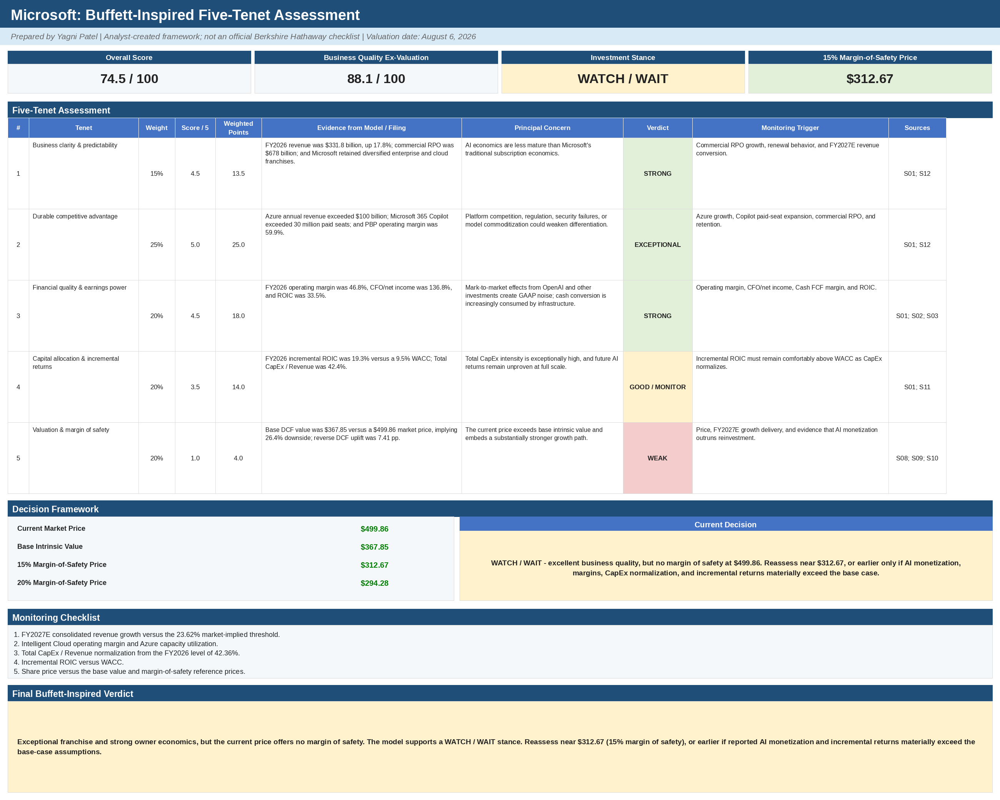

# Buffett-Inspired Five-Tenet Assessment

> This is an analyst-created framework inspired by Warren Buffett's emphasis on understandable businesses, durable competitive advantages, owner earnings, rational capital allocation, and margin of safety. It is **not** an official Berkshire Hathaway checklist.

**Prepared by:** Yagni Patel  
**Valuation date:** August 6, 2026  
**Current market price:** $499.86  
**Base DCF value:** $367.85  
**Overall score:** 74.5 / 100  
**Business-quality score excluding valuation:** 88.1 / 100  
**Stance:** **WATCH / WAIT**

## Scorecard

| Tenet | Weight | Score | Weighted points | Assessment |
|---|---:|---:|---:|---|
| Business clarity and predictability | 15% | 4.5 / 5 | 13.5 | Strong recurring enterprise and cloud economics, diversified franchises, and substantial contracted revenue. AI economics are less mature than Microsoft's traditional subscription model. |
| Durable competitive advantage | 25% | 5.0 / 5 | 25.0 | Azure, Microsoft 365, identity, security, developer tools, distribution, switching costs, and ecosystem integration create an exceptional moat. |
| Financial quality and earnings power | 20% | 4.5 / 5 | 18.0 | FY2026 operating margin was 46.8%, CFO / Net Income was 136.8%, and ROIC was 33.5%. Cash conversion remains strong, although infrastructure investment is absorbing more cash flow. |
| Capital allocation and incremental returns | 20% | 3.5 / 5 | 14.0 | FY2026 incremental ROIC was 19.3%, above the 9.47% WACC. However, Total CapEx reached 42.4% of revenue, so future AI returns remain the key unresolved issue. |
| Valuation and margin of safety | 20% | 1.0 / 5 | 4.0 | The $499.86 market price is 35.9% above the $367.85 base value. The reverse DCF requires a 7.41 percentage-point FY2027E growth uplift above the base case. |
| **Total** | **100%** |  | **74.5 / 100** | **Exceptional business quality, insufficient margin of safety.** |

## Tenet 1: Business clarity and predictability

Microsoft's core economics are understandable: subscription software, cloud infrastructure, enterprise applications, operating systems, gaming/content, and advertising. The commercial business benefits from multi-year agreements and substantial remaining performance obligations. At FY2026 year-end, commercial remaining performance obligation (RPO) reached $678 billion, providing visibility into contracted future revenue. Microsoft also reported FY2026 revenue of $331.8 billion, up 18%.

The main source of uncertainty is not demand for Microsoft's established products; it is the cost and return profile of large-scale AI infrastructure. AI workload economics, utilization, pricing, and competitive intensity are still developing.

## Tenet 2: Durable competitive advantage

Microsoft's moat is unusually broad:

- Microsoft 365 is embedded in enterprise workflows.
- Azure combines infrastructure, data, AI, security, and developer services.
- Identity, security, GitHub, Windows, Dynamics, LinkedIn, and Power Platform reinforce the ecosystem.
- Enterprise switching costs are high because of data, workflows, compliance, training, and application integration.
- Distribution is strengthened by long-standing enterprise relationships and bundled commercial agreements.

In FY2026, Azure annual revenue exceeded $100 billion and Microsoft 365 Copilot surpassed 30 million paid seats. These indicators support the view that Microsoft is monetizing AI through existing distribution rather than building a customer base from scratch.

## Tenet 3: Financial quality and earnings power

The model shows high-quality earnings:

- FY2026 operating margin: **46.78%**
- FY2026 CFO / Net Income: **136.77%**
- FY2026 ROIC: **33.55%**
- FY2026 cash FCF margin: **20.19%**

Operating profitability has improved despite the infrastructure buildout. The caution is that cash FCF conversion has weakened because cash CapEx rose sharply. This is why the model separates cash-based UFCF from lease-adjusted UFCF.

## Tenet 4: Capital allocation and incremental returns

Microsoft has continued to fund organic investment while returning capital through dividends and repurchases. The critical issue is the scale of AI and cloud reinvestment:

- FY2026 cash CapEx/revenue: **34.94%**
- FY2026 total CapEx/revenue: **42.36%**
- FY2026 incremental ROIC: **19.34%**
- WACC: **9.47%**

Incremental ROIC remains above WACC, indicating value creation. However, the spread is narrower than Microsoft's historical ROIC and the denominator is expanding rapidly. The quality of the investment depends on utilization and monetization catching up with the installed capacity.

## Tenet 5: Valuation and margin of safety

| Reference | Price |
|---|---:|
| Current market price | $499.86 |
| Base intrinsic value | $367.85 |
| 15% margin-of-safety price | $312.67 |
| 20% margin-of-safety price | $294.28 |

The current price offers no margin of safety under the base case. It also requires market-implied FY2027E consolidated revenue growth of 23.62%, compared with the 16.22% base forecast, while holding operating-margin and reinvestment assumptions constant.

## Decision

**WATCH / WAIT.** Microsoft is an exceptional franchise, but the model does not support a purchase at the reference price. The investment should be reconsidered if:

1. The price approaches approximately **$312.67**, representing a 15% discount to the base value; or
2. Reported AI monetization, Intelligent Cloud margins, CapEx normalization, and incremental ROIC materially exceed the base assumptions.

## Primary monitoring variables

- FY2027E consolidated revenue growth versus the 23.62% market-implied threshold
- Azure growth and Intelligent Cloud operating margin
- Copilot paid-seat growth and revenue contribution
- Total CapEx / Revenue normalization
- Incremental ROIC relative to WACC
- Lease-adjusted UFCF recovery

## Sources

- [Microsoft FY2026 Q4 earnings release](https://www.microsoft.com/en-us/investor/earnings/fy-2026-q4/press-release-webcast)
- [Microsoft FY2025 Annual Report](https://www.microsoft.com/investor/reports/ar25/index.html)
- [Microsoft SEC filings](https://www.sec.gov/edgar/browse/?CIK=789019&owner=exclude)
- [U.S. Treasury yield curve data](https://home.treasury.gov/resource-center/data-chart-center/interest-rates/TextView?field_tdr_date_value=2026&type=daily_treasury_yield_curve)
